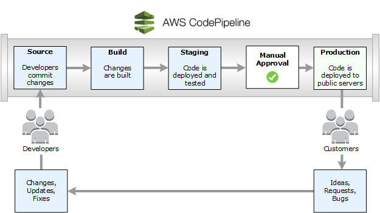

# DevOps
DevOps에 대한 개념 및 AWS의 여러 Tool 사용을 통한 실습 및 연구 [](https://aws.amazon.com/ko/devops/what-is-devops/)


### DevOps 모델 정의

- DevOps는 application과 service를 빠른 속도로 제공할 수 있도록 조직의 역량을 향상시키는 문화 철학, 방식 및 도구의 조합을 의미한다.
- 기존의 Software 개발 및 Infra 관리 process를 사용하는 조직보다 제품을 더 빠르게 혁신하고 개선할 수 있다.


### DevOps 작동 방식

- DevOps Model에서는 개발팀과 운영팀이 더 이상 `Silo`에 묶여 있지 않고, 이 두 팀이 단일팀으로 병합되어 엔지니어가 Developement/Test/Deploy/Operation의 전체 application Life Cycle에 걸쳐 작업하고 단일 기능에 한정되지 않은 광범위한 기술을 개발한다.
- 일부 DevOps model에서 품질보증팀과 보안팀 또한 application life cycle에 걸쳐 개발 및 운영과 좀 더 긴밀하게 통합된다. DevOps팀 전체가 보안을 중점으로 두는 경우 `DevSecOps`라고도 한다.
- DevOps 방식을 사용하여 속도가 느리고 수동으로 수행되던 프로세스를 자동화하고, 애플리케이션을 안정적으로 빠르게 운영하고 개선하는 데 도움이 되는 기술 스택과 도구를 사용하게 된다. 이러한 도구 덕분에 엔지니어는 이전 같으면 다른 팀의 도움이 필요했을 코드 배포 또는 인프라 프로비저닝과 같이 작업을 독립적으로 수행할 수 있으며, 따라서 팀의 작업 속도가 더욱 빨라지게 된다.

### DevOps의 이점

- `속도`
	: 작업 속도가 빨라지므로 고객을 위해 더 빠르게 혁신하고, 시장 변화에 더 잘 적응하고, 좀 더 효율적으로 비즈니스 성과를 창출할 수 있다. DevOps 모델을 사용하면 개발자와 운영팀이 이러한 성과를 실현할 수 있는데, 예를 들어 MicroService와 지속적 전달을 사용하면 팀에서 서비스를 주도적으로 운영하여 업데이트를 좀 더 빠르게 릴리스할 수 있다.
- `신속한 제공`
	: release의 빈도와 속도를 개선하여 제품을 더 빠르게 혁신하고 개선할 수 있다. 새로운 기능의 릴리스와 버그 수정 속도가 빨라질수록 고객의 요구에 더 빠르게 대응하여 경쟁 우위를 강화할 수 있다. 지속적 통합과 지속적 전달은 빌드에서 배포까지 소프트웨어 릴리스 프로세스를 자동화하는 방식이다.
- `안정성`
	: 최종 사용자에게 지속적으로 긍정적인 경험을 제공하는 한편 더욱 빠르게 안정적으로 제공할 수 있도록 애플리케이션 업데이트와 인프라 변경의 품질을 보장한다. 지속적 통합 및 지속적 전달과 같은 방식을 사용하여 각 변경 사항이 제대로 작동하며 안전한지 테스트하고, 모니터링과 로깅 방식을 통해 실시간으로 성능에 대한 정보를 얻을 수 있다.
- `확장`
	: 규모에 따라 인프라와 개발 프로세스를 운영 및 관리한다. 자동화와 일관성이 지원되므로 위험을 줄이면서 복잡한 시스템 또는 변화하는 시스템을 효율적으로 관리할 수 있다. 예를 들어 코드형 인프라를 사용하면 개발, 테스트 및 프로덕션 환경을 반복 가능하고 좀 더 효율적인 방식으로 관리할 수 있다.
- `협업 강화`
	: 주인의식 및 책임과 같은 가치를 강조하는 DevOps 문화 모델에서 좀 더 효과적인 팀을 구축한다. 개발자와 운영팀은 긴밀하게 협력하고, 많은 책임을 공유하며, 워크플로를 결합한다. 이를 통해 비효율성을 줄이고 시간을 절약한다.
- `보안`
	: 제어를 유지하고 규정을 준수하면서 신속하게 진행할 수 있다. 자동화된 규정 준수 정책, 세분화된 제어 및 구성 관리 기술을 사용함으로써 보안을 그대로 유지하면서 DevOps 모델을 도입할 수 있다. 예를 들어 코드형 인프라와 코드형 정책을 사용하면 규모에 따라 규정 준수를 정의하고 추적할 수 있다.


### DevOps 모델을 도입하는 방법

- DevOps로 전환하기 위해서는 문화와 사고방식의 변화가 필요하다.
- DevOps는 기존에 Silo에 묶여 있던 개발과 운영이라는 두 팀 간의 장벽을 없애주며, 일부 조직에서는 개발팀과 운영팀이 나뉘어 있지 않고 엔지니어가 두 업무를 모두 수행할 수도 있다. 
- DevOps에서는 두 팀이 함께 작업하여 개발자의 생산성과 운영의 안정성을 모두 최적화한다.

- 조직이 소프트웨어 개발과 인프라 관리 프로세스의 자동화 및 간소화를 통해 더 빠르게 혁신할 수 있도록 지원하는 몇 가지 주요 방식이 있는데, 이러한 방식 대부분은 적절한 도구를 사용해 수행된다.

- 기본 방식 중 하나는 소규모 업데이트를 자주 수행하는 것으로, 이 방식을 통해 조직은 고객을 위해 더 빠르게 혁신할 수 있다. 소규모로 자주 업데이트하면 각 배포의 위험이 줄어든다. 팀에서 오류의 원인이 되는 최근 배포를 확인할 수 있으므로 더 빠르게 버그를 해결할 수 있고, 업데이트 소요 시간과 규모는 다르지만, DevOps 모델을 사용하는 조직은 기존 소프트웨어 개발 방식을 사용하는 조직보다 훨씬 더 자주 업데이트를 배포하게 된다.
- 또, microservice architecture를 사용하여 애플리케이션의 유연성과 혁신의 속도를 높일 수 있다. microservice architecture는 복잡한 대규모 시스템을 간단하고 독립적인 프로젝트로 결합 해제하게 된다. 애플리케이션은 많은 개별 구성 요소(서비스)로 분할되며, 각 서비스는 단일 목적 또는 기능으로 한정되고 피어 서비스 및 전체 애플리케이션과는 별개로 운영된다.
- 그러나, 마이크로 서비스와 릴리스 빈도 증가의 조합은 배포 수를 현저히 늘려 운영 문제로 이어질 수 있다. 따라서 지속적 통합 및 지속적 전달과 같은 DevOps 방식을 사용하면, 이러한 문제를 해결하고 조직이 안전하고 안정적인 방식으로 신속하게 업데이트를 제공할 수 있게 된다.
- 코드형 인프라 및 구성 관리와 같은 인프라 자동화 방식은 잦은 변경에 대해 컴퓨팅 리소스를 탄력적이고 대응적으로 유지하는 데 도움이 된다. 또한, 모니터링과 로깅의 사용도 엔지니어가 애플리케이션 및 인프라의 성능을 추적하여 문제에 신속하게 대응할 수 있게 하는 데 도움이 된다.

- [지속적 통합] ▶ [지속적 전달] ▶ [Mocroservice] ▶ [Code형 Infra] ▶ [Monitoring & Logging] ▶ [Communication & Cooperation]

---

### ■ 지속적 통합 (CodeCommit) [](https://docs.aws.amazon.com/ko_kr/codecommit/latest/userguide/welcome.html)

- 자동화된 빌드 및 테스트가 수행된 후, 개발자가 코드 변경 사항을 중앙 리포지토리에 정기적으로 병합하는 소프트웨어 개발 방식
- 지속적 통합의 핵심 목표는 버그를 신속하게 찾아 해결하고, 소프트웨어 품질을 개선하고, 새로운 소프트웨어 업데이트를 검증 및 릴리스하는데 걸리는 시간을 단축하는 것이다.


#### ☞ 1단계: CodeCommit 리포지토리 사용을 위한 권한 및 SSH 설정

- IAM Console에서 기존 정책 직접 연결을 통해 사용자에 `AWSCodeCommitPowerUser` 권한을 추가해 준다.


- CodeCommit은 Git 버전 1.7.9 이상을 사용해야 한다.
- SSH 및 Windows : Git 및 CodeCommit에 대한 퍼블릭 및 프라이빗 키 설정 후, `codecommit_rsa.pub` 파일 내용을 복사한다.
	- `codecommit_rsa` : Private Key File
	- `codecommit_rsa.pub` : Public Key File

```bash
$ ssh-keygen
```

- IAM Console > 내 보안 자격 증명에서 Upload SSH public key를 Upload한다.


- `~/.ssh` 디렉터리에서 config 파일을 생성한다.

```bash
$ notepad ~/.ssh/config
```

- 파일에 다음 행을 추가한다. `User 값`은 앞서 복사한 SSH Key ID이고 `IdentityFile`은 Private Key File의 경로 및 이름 (파일 이름은 파일 확장명 없이 config여야 한다. 그렇지 않으면 SSH 연결 실패)

```bash
Host git-codecommit.*.amazonaws.com
  User SSH Key
  IdentityFile ~/.ssh/codecommit_rsa
```

- SSH 구성 테스트

```bash
$ ssh git-codecommit.us-east-2.amazonaws.com

You have successfully authenticated over SSH. You can use Git to interact with AWS CodeCommit. Interactive shells are not supported.Connection to git-codecommit.us-east-2.amazonaws.com closed by remote host.
Connection to git-codecommit.us-east-2.amazonaws.com closed.
```

#### ☞ 2단계: CodeCommit 리포지토리 생성 및 Repository 복제

- https://console.aws.amazon.com/codecommit/ 에서 CodeCommit 콘솔을 열고 Create repository (`MyDemoRepo`)

- Local repository를 설정하려면 console에서 새 리포지토리를 연 상태에서 페이지 오른쪽 상단의 URL 복제를 선택한 후, Clone SSH(SSH 복제)를 선택한다. Git 리포지토리를 복제할 주소는 클립보드에 복사된다.
- 터미널 또는 명령줄에서 로컬 리포지토리를 저장하고 싶은 로컬 디렉터리로 이동한다. (`/tmp`)
- 다음 명령을 실행하여 리포지토리를 복제하여 SSH 주소를 앞 단계에서 복사한 주소로 교체한다. 이 명령을 통해 MyDemoRepo라는 디렉터리가 생성되고 이 디렉터리에 샘플 애플리케이션을 복사한다.

```bash
$ git clone ssh://Your-SSH-Key-ID@git-codecommit.us-east-2.amazonaws.com/v1/repos/MyDemoRepo
```

#### ☞ 3단계: CodeCommit 리포지토리에 Sample Code 추가

- `SampleApp_Linux.zip` 파일을 다운로드하여 앞 단계에서 생성한 `my-demo-repo`에 파일을 복사한다.

```bash
/my-demo-repo
   │-- appspec.yml
   │-- index.html
   │-- LICENSE.txt
   └-- scripts
       │-- install_dependencies
       │-- start_server
       └-- stop_server
```

- 모든 파일 Staging, Commit, Push를 수행한다.

```bash
$ git add -A
$ git commit -m "Add sample application files"
$ git push
```


---

### ■ 지속적 전달 (CodePipeline) [](https://docs.aws.amazon.com/ko_kr/codepipeline/latest/userguide/welcome.html)

- CodePipeline은 소프트웨어 변경 내용을 지속적으로 릴리스하는데 필요한 단계를 자동화한다.
- 프로덕션에 릴리스하기 위한 코드 변경이 자동으로 빌드, 테스트 및 준비되는 소프트웨어 개발 방식
- 빌드 단계 이후의 모든 코드 변경 사항을 테스트 환경 및/또는 프로덕션 환경에 배포함으로써 지속적 통합을 확장한다. 지속적 전달이 적절하게 구현되면, 개발자는 언제나 즉시 배포할 수 있고 표준화된 테스트 프로세스를 통과한 빌드 아티팩트를 보유하게 된다.



#### ☞ 배포 단계 : CodeDeploy [](https://docs.aws.amazon.com/ko_kr/codedeploy/latest/userguide/welcome.html)

- CodeDeploy는 Amazon EC2 인스턴스, 온프레미스 인스턴스, 서버리스 Lambda 함수 또는 Amazon ECS 서비스로 애플리케이션 배포를 자동화하는 배포 서비스를 말한다.
- Code, 서버리스 AWS Lambda 함수, 웹 및 구성 파일, 실행 파일, packages, 스크립트, 멀티미디어 파일의 다양한 애플리케이션 콘텐츠를 거의 무제한으로 배포할 수 있다.

- EC2 Linux 인스턴스 생성 및 CodeDeploy 에이전트 설치 (free version으로 1$가 결재된다.)
	- sample application이 배포되는 EC2 인스턴스를 생성한다.
	- 이 프로세스의 일부로 EC2 instance에 CodeDeploy agent를 설치한다.
	- CodeDeploy agent는 instance를 CodeDeploy 배포에서 사용할 수 있게 해주는 software package이다.
	- instance에 IAM 역할을 연결하여 CodeDeploy agent가 application 배포에 사용하는 파일을 가져올 수 있게 허용해 준다.

- 인스턴스 역할을 생성을 위해 IAM > 역할만들기 > AWS서비스/EC2 사용사례 > `AmazonEC2RoleforAWSCodeDeploy` 권한 추가 > 역할 이름 `EC2InstanceRole` 으로 생성
- 인스턴스 시작을 위해 Amazon EC2 콘솔 (https://console.aws.amazon.com/ec2/) 에서 `실행중인 인스턴스` 선택 후 `인스턴스 시작`
	- [Step 1] : Amazon Linux 2 AMI (HVM), SSD Volume Type 선택
	- [Step 2] : Choose an Instance Type에서 프리 티어 가능 t2.micro 유형을 선택

	

	- [Step 3] : Configure Instance Details에서 인스턴스 수 `1`, 퍼블릭 IP 자동 할당 `활성화`, IAM role `EC2InstanceRole` 선택
	- [Step 4] : Add Storage 항목은 패스, Add Tag에서 [Key]에 Name을 입력하고 [Value]에 MyCodePipelineDemo를 입력한다.
	- [Step 5] : Configure Security Group에서 [SSH] 행의 [Source]에서 [My IP]를 선택 후, 규칙 추가하여 [HTTP] [Source]에서 [My IP]를 선택
	- [Step 6] : Launch 후, key pair를 다운로드 하고 인스턴스를 시작한다.

	
	

- EC2에 CodeDeploy Agent 설치하기
	- [Step 1] : PuTTY를 통한 EC2 Instance에 접속하기 [](https://docs.aws.amazon.com/ko_kr/AWSEC2/latest/UserGuide/putty.html?icmpid=docs_ec2_console) (ID: ec2-user)
	- [Step 2] : Instance 설정하기, 하기와 같이 설정

```bash
$sudo yum -y update
$sudo yum install -y ruby
$sudo yum install -y aws-cli
$cd /home/ec2-user
$sudo aws configure # AWS 접속을 위한 Access Key, Secret Access Key, region name, output format :json
$wget https://aws-codedeploy-ap-northeast-2.s3.amazonaws.com/latest/install # Agent 설치파일을 다운로드
$chmod +x ./install # 실행권한을 추가
$sudo ./install auto # 설치 진행
$sudo service codedeploy-agent status # Agent가 실행중인지 확인

The AWS CodeDeploy agent is running as PID 6683

$sudo vim /etc/init.d/codedeploy-startup.sh # EC2 인스턴스가 부팅되면 자동으로 AWS CodeDeploy Agent가 실행될 수 있도록 /etc/init.d/에 쉘 스크립트 파일을 생성

#!/bin/bash 
echo 'Starting codedeploy-agent' 
sudo service codedeploy-agent restart

$sudo chmod +x /etc/init.d/codedeploy-startup.sh # 스크립트 파일을 저장한뒤, 실행권한을 추가
```

- CodeDeploy에서 application 생성하기
	- [Step 1] 서비스 역할 생성 : CodeDeploy 서비스 역할 생성을 위해 IAM Console에서 Create Role하여 사용 사례 선택에서 `CodeDeploy`를 선택한 후, 역할 이름(CodeDeployRole)을 입력한 후 역할 생성
	- [Step 2] 애플리케이션 생성 : CodeDeploy 콘솔에서 application을 생성한다. (name: `MyDemoApplication`, 컴퓨팅 플랫폼: `EC2/온프레미스`)

	

	- [Step 3] 배포 그룹 생성 : 배포 그룹명 `MyDemoDeploymentGroup`, 서비스 역할명 `CodeDeployRole`, 배포유형 `현재 위치`, 환경 구성 `Amazon EC2 인스턴스`에서 Key값 `MyCodePipelineDemo`, 배포 구성 `CodeDeployDefault.OneAtaTime`, 로드 밸런싱 `비활성화`, 경보구성 `무시`

- CodePipeline에서 첫 번째 파이프라인 생성하기
	- [Step 1] 파이프라인 설정 : 파이프라인명 `MyFirstPipeline`, 새 서비스역할 선택
	- [Step 2] 소스 스테이지 설정 : 소스 공급자 `AWS CodeCommit`, 리포지토리 이름 `MyDemoRepo`, 브랜치명 `master`
	- [Step 3] 빌드 스테이지 설정 : 본 실습에서는 빌드 서비스가 필요 없는 코드를 배포하므로 이 단계는 skip한다.
	- [Step 4] 배포 스테이지 설정 : 배포 공급자 `AWS CodeDeploy`, 애플리케이션명 `MyDemoApplication`, 배포그룹 `MyDemoDeploymentGroup` 설정 후 파이프라인 생성

	

	- [Step 5] 파이프라인 결과 확인 : EC2 Instance의 Public DNS (http://ec2-3-22-68-153.us-east-2.compute.amazonaws.com/) 를 웹 브라우저에서 확인

	

---

#### ☞ Build 단계 : CodeBuild [](https://docs.aws.amazon.com/ko_kr/codebuild/latest/userguide/welcome.html)

- CodeBuild는 Source Code를 Compile하고 단위 테스트를 실행하며 배포할 준비가 완료된 Artifact를 생성한다.
- CodeBuild에서는 자체 빌드 서버를 프로비저닝, 관리 및 확장할 필요가 없고, Apache Maven, Gradle 등과 같은 널리 사용되는 프로그래밍 언어 및 빌드 도구에 맞게 사전 패키지된 빌드 환경을 제공한다.
- CodeBuild는 최대 빌드 요청 수에 맞게 자동으로 확장된다.


- Console을 사용하여 AWS CodeBuild 시작하기
	- [Step 1] : 두 개의 S3 버킷 생성 (입력 : `codebuild-region-ID-account-ID-input-bucket`, 출력 : `codebuild-region-ID-account-ID-output-bucket`)
	- [Step 2] : 소스 코드 생성, MessageUtil.java 및 TestMessageUtil.java, pom.xml 파일 생성 (Source는 GitHub 및 CodeCommit, Bitbucket의 Repository를 연동하여 가져올 수도 있다)
	- [Step 3] : buildspec.yml 파일 생성 후, 소스 코드 및 빌드 사양 파일을 입력 버킷에 추가 (`MessageUtil.zip` 파일을 생성)

	

	- [Step 4] : 빌드 프로젝트 생성, CodeBuild Console (https://console.aws.amazon.com/codesuite/codebuild/home) 에 접속하여, 빌드 프로젝트명(`codebuild-demo-project`) 입력 후
		- 소스의 소스 공급자 `Amazon S3`, 버킷 `codebuild-region-ID-account-ID-input-bucket`, S3 object key(S3 객체 키) `MessageUtil.zip`, 환경 이미지 `관리형 이미지`
		- 운영 체제 `Amazon Linux 2`, 런타임 `표준`, 이미지 `aws/codebuild/amazonlinux2-x86_64-standard:2.0`, 서비스 역할 `New service role(새 서비스 역할)`
		- Buildspec(빌드 사양) `Use a buildspec file(빌드 사양 파일 사용)`, 결과물 유형 `Amazon S3`, 버킷 이름 `codebuild-region-ID-account-ID-output-bucket`

	

	- [Step 5] : 빌드 실행 후, 단계별 빌드 정보를 확인할 수 있다.

	
	

	- [Step 6] : 빌드 출력 artifact 가져오기, Amazon S3 콘솔에서 출력 버킷을 선택하여 target 폴더에서 빌드 출력 결과물을 확인한다.

	

---

### ■ Communication & Cooperation (CodeStar) [](https://docs.aws.amazon.com/ko_kr/codestar/latest/userguide/welcome.html)

- AWS CodeStar는 AWS에서 소프트웨어 개발 프로젝트를 생성, 관리, 작업하기 위한 클라우드 기반 서비스
- AWS CodeStar 프로젝트를 통해 AWS에서 애플리케이션을 빠르게 개발, 빌드, 배포할 수 있다.
- AWS CodeStar 프로젝트는 프로젝트 개발 도구 체인에 대한 AWS 서비스를 생성 및 통합한다.
- 선택한 AWS CodeStar 프로젝트 템플릿에 따라, 도구 체인에 소스 제어, 빌드, 배포, 가상 서버 또는 서버리스 리소스 등이 포함될 수 있다.
- AWS CodeStar는 (팀원이라고 하는) 프로젝트 사용자에 필요한 권한을 관리한다. 프로젝트 소유자는 사용자를 프로젝트에 팀원으로 추가하여 각 팀원의 역할에 따라 프로젝트 및 리소스에 대한 액세스 권한을 쉽고 빠르게 부여할 수 있다.

#### AWS CodeStar로 할 수 있는 작업 [](https://us-east-2.console.aws.amazon.com/codestar/home?region=us-east-2#/)

- 웹 애플리케이션, 웹 서비스 등에 대한 템플릿을 사용하여 AWS에서 몇 분 이내에 새 소프트웨어 프로젝트를 시작
- 팀에 대한 프로젝트 액세스 관리
- 한 곳에서 프로젝트에 대한 시각화, 운영 협업
- 필요한 모든 도구로 신속하게 반복

#### ☞ CodeStar 설정 단계

- AWS CodeStar 서비스 역할 만들기
	- [Step 1] : 서비스 역할 생성

	

	- [Step 2] : IAM 사용자에 대한 권한 구성, IAM 콘솔에서 `AWSCodeStarFullAccess` 관리형 정책을 프로젝트 생성에 사용한 IAM 사용자에 연결
	- [Step 3] : 연합된 사용자를 위해 권한 구성하기, 연합된 사용자는 사용자가 AWS CodeStar API를 사용하고 프로젝트(예: Amazon EC2 또는 AWS Lambda)에서 사용하는 모든 리소스에 액세스하게 하는 IAM 권한이 있어야 한다.
	- [Step 4] : AWS CodeStar 프로젝트에 대한 Amazon EC2 키 페어 만들기 [](https://docs.aws.amazon.com/ko_kr/AWSEC2/latest/UserGuide/ec2-key-pairs.html)

#### ☞ Serverless Project 생성 및 관리

- AWS CodeStar를 사용하여 AWS SAM을 통해 Python 기반 웹 서비스를 빌드 및 배포하는 프로젝트를 생성할 수 있다.
	- [Step 1] : 프로젝트 생성, 애플리케이션 범주 `웹 서비스`, 프로그래밍 언어 `Python`, AWS 서비스 `AWS Lambda` 선택, 프로젝트명 `My SAM Project`, "AWS CodeStar는 사용자 대신 AWS 리소스를 관리할 수 있는 권한이 필요합니다" 선택 후 Welcome to My SAM Project!가 표시될 때까지 대기 (`my-sam-project-Pipeline`, `awscodestar-my-sam-project-lambda-HelloWorld`가 자동 생성된다.)

	

	- [Step 2] : CodeCommit에서 소스 코드 리포지토리를 탐색, AWS CodeStar 콘솔에서 프로젝트를 열어 둔 상태로 측면 탐색 모음에서 코드를 선택
		- `buildspec.yml` : CodePipeline는 CodeBuild가 빌드 단계에서 AWS SAM을 사용하여 웹 서비스를 패키징하도록 지시한다.
		- `index.py` : Lambda 함수에 대한 로직을 포함하며, 이 함수는 ISO 형식의 문자열 Hello World와 타임스탬프를 출력힌다.
		- `README.md` : 리포지토리에 대한 일반 정보를 포함힌다.
		- `template-configuation.json` : 프로젝트 ID로 리소스에 태그를 지정하는 데 사용되는 자리 표시자와 함께 프로젝트 ARN을 포함한다.
		- `template.yml` : AWS SAM이 웹 서비스를 패키징하고 API 게이트웨이에서 API를 만드는 데 사용힌다.

	

	- [Step 3] : 웹 서비스 테스트, 이전 단계의 프로젝트를 열어 둔 상태로 측면 탐색 모음에서 대시보드를 선택 (연속 배포 타일에서 소스, 빌드 및 배포 단계에 대해 Succeeded 확인)한 후, 애플리케이션 엔드포인트 링크를 선택 (`https://API_ID.execute-api.REGION_ID.amazonaws.com/Prod/`)

	


#### ☞ 프로젝트 코드를 편집하기 위한 로컬 워크스테이션 설정

- 로컬 워크스테이션을 설정하여 AWS CodeStar 프로젝트의 소스 코드를 편집한다.
	- [Step 1] : Visual Studio가 설치되어 있으면, Visual Studio 및 리포지토리 복제 URL에서 `HTTPS`를 선택한 후, 지침보기를 선택
	- [Step 2] : AWS Toolkit for Visual Studio 설치 후, Visual Studio에 연결 AWS Explorer에서 Add a Region 선택
	- [Step 3] : 로컬 워크스테이션에 Git을 설정하고, IAM 사용자에 대한 Git 자격 증명을 생성

	

	- [Step 4] : 프로젝트의 CodeCommit 리포지토리를 로컬 워크스테이션에 복제 후, VS Code에 `Git Extension Pack` 설치

```bash
$ git clone ssh://git-codecommit.us-east-2.amazonaws.com/v1/repos/My-SAM-Project
```

#### ☞ 웹 서비스에 로직 추가

- 로컬 워크스테이션을 사용하여 웹 서비스에 로직을 추가하고, Lambda 함수를 추가한 다음 API 게이트웨이의 API에 연결해 본다.
- `hello.py` 파일 추가 및 `template.yml` 파일에 내용 추가

```bash
$ git add .

$ git commit -m "Added hello.py and updated template.yaml."
[master 328ab7c] Added hello.py and updated template.yaml.
 2 files changed, 27 insertions(+), 1 deletion(-)
 create mode 100644 hello.py

$ git push
Enumerating objects: 6, done.
Counting objects: 100% (6/6), done.
Delta compression using up to 4 threads
Compressing objects: 100% (4/4), done.
Writing objects: 100% (4/4), 565 bytes | 141.00 KiB/s, done.
Total 4 (delta 2), reused 0 (delta 0)
To ssh://git-codecommit.us-east-2.amazonaws.com/v1/repos/My-SAM-Project
   da5ccd4..328ab7c  master -> master
```

- AWS CodeStar는 Push를 감지한 후, CodePipeline가 CodeBuild 및 AWS SAM을 사용하여 자동으로 웹 서비스를 다시 빌드 및 배포하도록 지시한다. 프로젝트 대시보드에서 배포 진행 상황을 볼 수 있다.


- 애플리케이션 엔드포인트 URL(예: https://API_ID.execute-api.REGION_ID.amazonaws.com/Prod/hello/mincloud) 결과를 확인한다.

```bash
{"output": "Hello mincloud"}
```

#### ☞ CodeStar로 Team 작업하기


- AWS CodeStar 콘솔 (https://console.aws.amazon.com/codestar/) 에서 Team을 선택하여 팀원 (IAM 사용자)을 추가한다.
- 팀원 추가 탭의 프로젝트 역할에서 이 사용자의 AWS CodeStar 역할(소유자, 기고자 또는 최종 사용자)을 선택한다.
- 새 팀원에게 다음 정보를 제공한다.
	- AWS CodeStar 프로젝트의 연결 정보
	- 소스 코드가 CodeCommit에 저장되어 있는 경우 로컬 컴퓨터에서 Git 자격 증명으로 CodeCommit 리포지토리에 대한 액세스를 설정하는 지침
	- AWS CodeStar 사용자 프로필 작업 에 설명된 대로 사용자가 표시 이름, 이메일 주소, 퍼블릭 Amazon EC2 SSH 키를 관리하는 방법에 대한 정보
	- 일회용 암호와 연결 정보(사용자가 AWS를 처음 사용하며 해당 사용자의 IAM 사용자를 만든 경우) 암호는 사용자가 처음 로그인하면 만료되며, 사용자는 새 암호를 선택해야 한다.

---

### AWS Cloud9 [](https://docs.aws.amazon.com/ko_kr/cloud9/latest/user-guide/welcome.html)

- AWS Cloud9은 코드를 작성, 실행 및 디버깅하는 데 사용하는 클라우드 기반 통합 개발 환경(IDE)
- AWS Cloud9를 사용하면 소프트웨어를 코드화, 빌드, 실행, 테스트, 디버그 및 릴리스할 수 있다.
	- 여러 프로그래밍 언어로 된 코드 및 AWS 클라우드 개발 키트 사용 (AWS CDK)
	- 실행 중인 도커 컨테이너에서 코드 작업
	- 온라인 코드 리포지토리 사용
	- 실시간으로 다른 사람과 협업
	- 다양한 데이터베이스 및 웹 사이트 기술과 상호 작용
	- AWS Lambda, Amazon API Gateway 및 AWS Serverless Applications 대상 지정
	- Amazon Lightsail, AWS CodeStar 등 기타 AWS 제품 활용 AWS 코드파이프라인

- Individual User Setup procedures를 통해 Cloud9을 사용해 보자.
	- [Step 1] : Cloud9 console (https://console.aws.amazon.com/cloud9) 접속하여, 환경 생성 (환경명 `my-demo-environment`)
	- [Step 2] : Environment type `EC2`, Instance type `t2.micro`, Platform `Amazon Linux`, Cost-saving setting `After 30 minutes (default)`

	
	

	- [Step 3] : 오른쪽 Remote Function 창에서 이전 my-sam-prject를 import해 보자.

	

	- [Step 4] : 오른쪽 위 Share를 통해 다른 사용자와 IDE를 공유하여 사용할 수 있다.

	

---

### ■ Microservice

- 단일 애플리케이션을 작은 서비스의 집합으로 구축하는 설계 접근 방식
- 각 서비스는 자체 프로세스에서 실행되고, 주로 HTTP 기반 API라는 간편한 메커니즘을 사용하는 잘 정의된 인터페이스를 통해 다른 서비스와 통신한다.
- 비즈니스 기능을 중심으로 구축되며, 각 서비스는 단일 목적으로 한정되어 있다. 다양한 프레임워크 또는 프로그래밍 언어를 사용하여 마이크로 서비스를 작성하고, 이를 독립적으로 단일 서비스 또는 서비스 그룹으로 배포할 수 있다.

### ■ Code형 Infra

- 버전 관리 및 지속적 통합과 같은 코드와 소프트웨어 개발 기술을 사용하여 인프라를 프로비저닝하고 관리하는 방식
- Cloud의 API 중심 모델을 사용하면 개발자와 시스템 관리자가 수동으로 리소스를 설정 및 구성할 필요 없이 프로그래밍 방식으로 대규모로 인프라와 상호 작용할 수 있다.
- 엔지니어는 코드 기반 도구를 사용하여 인프라와 인터페이스하고, 애플리케이션 코드를 다루는 방법과 유사한 방식으로 인프라를 다룰 수 있다.
- 인프라가 코드를 통해 정의되므로 인프라와 서버를 표준화된 패턴을 사용하여 배포하고, 최신 패치와 버전으로 업데이트하거나, 반복 가능한 방식으로 복제할 수 있다.

### ■ Monitoring & Logging

- 조직은 지표와 로그를 모니터링하여 애플리케이션 및 인프라 성능이 제품의 최종 사용자 경험에 어떤 영향을 미치는지 확인한다.
- 조직은 애플리케이션과 인프라에서 생성되는 데이터 및 로그를 캡처하고 분류한 다음 이를 분석함으로써 변경 또는 업데이트가 사용자에게 어떤 영향을 주는지 이해하고, 문제의 근본 원인 또는 예상치 못한 변경에 대한 통찰력을 확보하게 된다.
